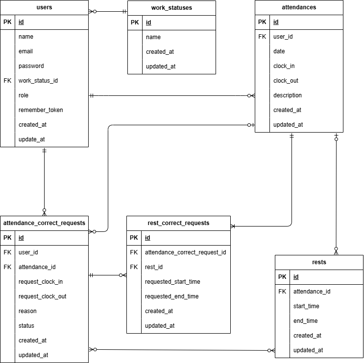

# attendance-app
実践学習ターム 模擬案件中級

## プロジェクト概要
従業員の勤怠(出勤・退勤)および休憩時間を管理し、必要に応じて勤怠情報の修正申請・承認を行うことが出来るシステムです。

1. サービスの目的
正確な労働時間の把握と、不正な打刻の防止、およびスムーズな修正申請フローを提供することを目的としています。

2. ターゲットユーザー
一般従業員：毎日の打刻を行い、自身の勤怠履歴の確認や修正申請を行うユーザー
管理者：従業員の勤怠一覧の確認や、出された修正申請の承認・却下を行うユーザー

3. 主な機能
勤怠管理：出勤・退勤の打刻、休憩の開始・戻りの記録
履歴管理：自身の勤怠一覧表示、月ごとの集計
修正申請：過去の打刻ミスに対する修正申請、管理者による承認フロー
ユーザー管理：会員登録、ログイン、ステータス管理(出勤中/休憩中など)

## 使用技術(Stack)
- **Framework**: Laravel 8.83.29
- **Language**: PHP 8.1
- **Database**: MySQL 8.0
- **Infrastructure**: Docker / Docker Compose
- **Mail Tool**: Mailhog

## 環境構築(Docker)

### 1.リポジトリのクローン
git clone git@github.com:moimoi8/attendance-app.git

### 2.環境変数の準備
.env.exampleをコピーして.envを作成し、環境に合わせて設定してください。
cp .env.example .env
設定が必要な主な項目（.env）:
MAIL_FROM_ADDRESS=admin@example.com（送信元メールアドレス）
※DB接続情報や、メール送信元アドレス（MAIL_FROM_ADDRESS）などを確認してください。

### 3.コンテナの起動
docker-compose up -d --build

### 4.依存関係のインストール
docker-compose exec php composer install

### 5.アプリケーションキーの生成
docker-compose exec php php artisan key:generate

### 6.データベースのセットアップ
docker-compose exec php php artisan migrate
docker-compose exec php php artisan db:seed

## 動作確認URL
アプリケーション本体: http://localhost/

## 動作確認方法(Mailhog)
本システムでは、会員登録時の本人確認や各種通知にメールを使用します。開発環境では実際のメール送信の代わりにMailhogを使用しており、以下の手順で送信されたメールの内容を確認できます。

### 1.アクセスURL:http://localhost:8025/

### 2.確認方法
アプリケーションからメールが送信されると、上記のURL(Mailhogのダッシュボード)にリアルタイムでメールが届きます。

## テーブル仕様
### usersテーブル
| カラム名 | 型 | primary key | unique key |
| id | bigint | ○ | --- |
| name | varchar(255) | --- | --- |
| email | varchar(255) | --- | ○ |
| password | varchar(255) | --- | --- |
| role | int | --- | --- |
| work_status_id | bigint | --- | --- |
| remember_token | varchar(100) | --- | --- |
| created_at | timestamp | --- | --- |
| updated_at | timestamp | --- | --- |

### attendanceテーブル
| カラム名 | 型 | primary key | unique key |
| id | bigint | ○ | --- |
| user_id | bigint | --- | --- |
| date | date | --- | --- |
| clock_in | time | --- | --- |
| clock_out | time | --- | --- |

### restsテーブル
| カラム名 | 型 | primary key | unique key |
| id | bigint | ○ | --- |
| attendance_id | bigint | --- | --- |
| start_time | time | --- | --- |
| end_time | time | --- | --- |

### attendance_correct_requestsテーブル
| カラム名 | 型 | primary key | unique key |
| id | bigint | ○ | --- |
| user_id | bigint | --- | --- |
| attendance_id | bigint | --- | --- |
| status | int | --- | --- |
| reason | text | --- | --- |
| date | date | --- | --- |
| clock_in | time | --- | --- |
| clock_out | time | --- | --- |

### rest_correct_requestsテーブル
| カラム名 | 型 | primary key | unique key |
| id | bigint | ○ | --- |
| attendance_correct_request_id | bigint | --- | --- |
| start_time | time | --- | --- |
| end_time | time | --- | --- |

## ER図

## テストの実行方法
docker-compose exec php php artisan test

## テストアカウント
ダミーデータとして、動作確認に必要な以下のユーザーをSeederにより作成しています。

| 役割 | 氏名 | メールアドレス | パスワード |
| --- | --- | --- | --- |
| 管理者 | 管理者 太郎 | admin@example.com | password123 |
| 一般ユーザー | テスト 花子 | user@example.com | password123 |
